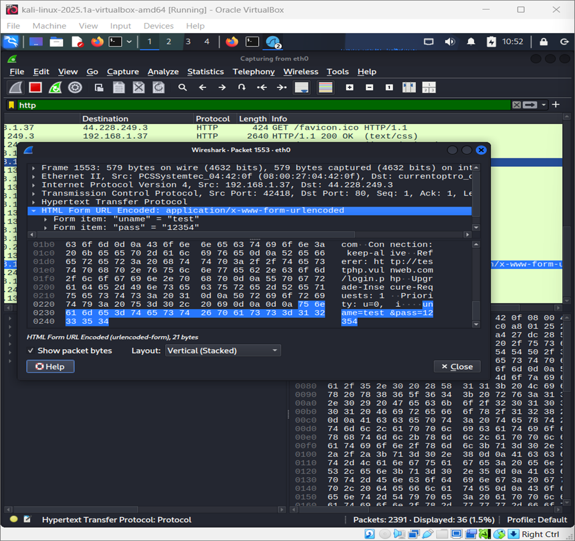

# Web_Application_Penetration_Testing_Capturing_Plaintext_Credentials_with_Wireshark
This project demonstrates how login credentials can be intercepted using Wireshark from an insecure web application. By capturing HTTP traffic on "testphp.vulnweb.com", we show how usernames and passwords are transmitted in plaintext, highlighting the risks of HTTP and the need for HTTPS encryption.

# About Wireshark

Wireshark is a network protocol analyzer that allows capturing and inspecting packets traveling across a network in real time.
1. It supports hundreds of protocols (HTTP, TCP, DNS, etc.).
2. Security researchers use it to detect vulnerabilities, analyze suspicious traffic, and troubleshoot        networks.
3. In penetration testing, it can reveal sensitive data (like usernames and passwords) when websites use insecure HTTP connections.

# Project Overview

This project demonstrates how login credentials can be intercepted from a vulnerable web application (http://testphp.vulnweb.com) using Wireshark.

1. Since the site uses HTTP (no encryption), login requests are sent in plaintext.
2. By capturing network traffic during a login attempt, we can clearly see the username and password in the packet data.
3. This shows the risks of using insecure protocols and highlights the importance of HTTPS encryption.

# Procedure
# Steps 
1. Launch Wireshark and Start Capturing

    Open Wireshark in Kali Linux (or any OS with Wireshark installed).

    Select the active network interface (e.g., eth0 for wired, wlan0 for Wi-Fi).

    Start capturing live traffic.

    To focus on login requests, apply the following filter in Wireshark:

        http.request.method == "POST"

    This filter ensures only HTTP POST requests (commonly used in login forms) are displayed.

2. Visit the Login Page and Enter Credentials

    Open a browser (Firefox/Chrome).

    Go to:
     http://testphp.vulnweb.com/login.php 

    Enter sample credentials:

            Username: test

            Password: 12354

    Click Login.

3. Terminate the Capture Session

    Once the login attempt is completed, stop the capture in Wireshark.

    Stopping at this stage avoids collecting unnecessary traffic and keeps the dataset focused only on the login attempt.

4. Analyze the Captured Packets
    Look for the HTTP POST request made to /login.php.

    Expand the packet details in Wireshark → Hypertext Transfer Protocol section.

    You will find the credentials in plaintext, for example:

            POST /login.php HTTP/1.1

            Host: testphp.vulnweb.com

            Content-Type: application/x-www-form-urlencoded

            Content-Length: 27

            uname=test&pass=12354&login=login

            

 As shown above, the username and password (uname=test, pass=12354) are clearly visible since the site does not use encryption (HTTPS).